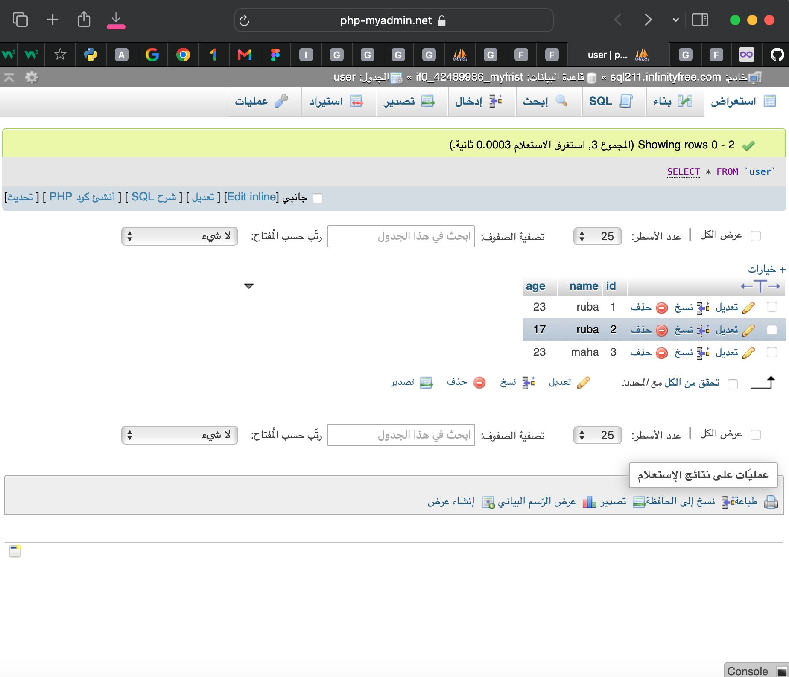

# Database


## Project Overview

This project is a simple web application developed using **PHP, MySQL, HTML, and SQL**.

The project demonstrates how PHP connects to a MySQL database, retrieves data using SQL queries, and displays the stored records on a web page.

---

## Technologies Used

- HTML
- PHP
- MySQL
- SQL
- phpMyAdmin

---

## Project Files

### HTML Files

The HTML files are used to create the basic structure and interface of the web page.

### PHP Files

The PHP files are responsible for:

- Connecting to the MySQL database.
- Executing SQL queries.
- Retrieving data from the database.
- Displaying the retrieved data on the web page.

---

## Database

The project uses a MySQL database with a table named:

`user`

The table contains three columns:

| Column | Description |
|--------|-------------|
| `id` | Unique ID for each user |
| `name` | User name |
| `age` | User age |

### Sample Data

| ID | Name | Age |
|----|------|-----|
| 1 | ruba | 23 |
| 2 | ruba | 17 |
| 3 | maha | 23 |

### Database Screenshot

The following screenshot shows the `user` table and the stored records in **phpMyAdmin**.



---

## PHP and MySQL Connection

The PHP code connects the web application to the MySQL database.

After establishing the connection, an SQL query is executed to retrieve the records from the `user` table.

Example SQL query:

```sql
SELECT * FROM user;
```

The retrieved data is then displayed on the web page using PHP.

---

## How the Project Works

### Step 1: Database Creation

A MySQL database was created using phpMyAdmin.

The database contains a table called `user`.

### Step 2: Adding Data

Sample user records were added to the table:

- ruba - 23
- ruba - 17
- maha - 23

### Step 3: Connecting PHP to MySQL

The PHP file establishes a connection with the MySQL database.

### Step 4: Retrieving Data

An SQL `SELECT` query is used to retrieve the records from the database.

### Step 5: Displaying the Results

PHP processes the retrieved data and displays it in the browser.

### PHP Output Screenshot

The following screenshot shows the data retrieved from the MySQL database and displayed through the PHP page.


